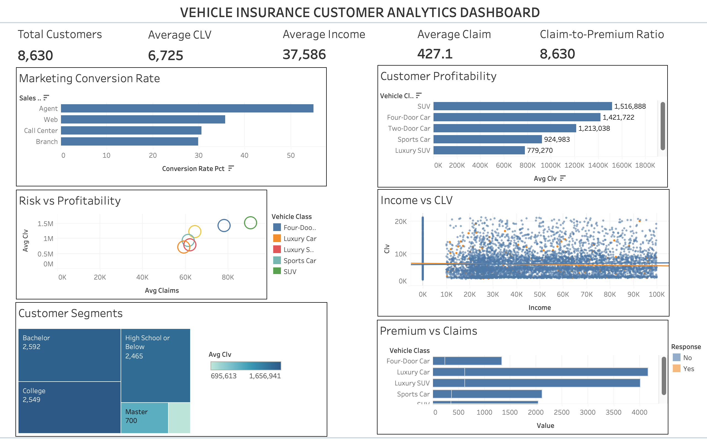

# 🚗 Vehicle Insurance Customer Analytics Dashboard

# 📸 Dashboard Preview

> 

---

## 📌 Project Overview

This project analyzes a vehicle insurance customer dataset using **MySQL** for data preparation and **Tableau** for interactive dashboard creation.

The objective is to transform raw customer data into meaningful business insights that help answer questions such as:

* Which marketing channels generate the highest customer response?
* Which customer segments are the most profitable?
* Which vehicle categories have the highest claim costs?
* Is customer income related to Customer Lifetime Value (CLV)?
* Which customer groups represent high risk and high profitability?

---

# 🛠️ Tech Stack

* **Python** – Data cleaning and preprocessing
* **Pandas** – Data manipulation
* **MySQL** – Data storage and SQL analytics
* **Tableau** – Dashboard development and visualization

---

# 📂 Dataset

The dataset contains customer information from a vehicle insurance company, including:

* Customer Lifetime Value (CLV)
* Income
* Monthly Premium
* Total Claim Amount
* Vehicle Class
* Vehicle Size
* Policy Information
* Marketing Response
* Sales Channel
* Coverage Type
* Employment Status
* Education
* Gender
* Location
* Marital Status

---

# 📊 Dashboard Features

The Tableau dashboard provides an executive overview through:

* Executive KPI Cards
* Marketing Performance Analysis
* Customer Profitability Analysis
* Risk vs Profitability Analysis
* Premium vs Claim Comparison
* Customer Segmentation
* Income vs Customer Lifetime Value Analysis

---

# 📈 Key Visualizations

## 1. Executive KPI Cards

Displays:

* Total Customers
* Average Customer Lifetime Value
* Average Customer Income
* Average Monthly Premium
* Average Claim Amount
* Claim-to-Premium Ratio

Purpose:

Provides a quick overview of the company's overall business performance.

---

## 2. Marketing Conversion by Sales Channel

**Chart:** Horizontal Bar Chart

Shows:

* Conversion Rate by Sales Channel

Business Insight:

Identifies the most effective marketing channels and helps optimize marketing spending.

---

## 3. Customer Profitability by Vehicle Class

**Chart:** Horizontal Bar Chart

Shows:

* Average Customer Lifetime Value across different vehicle classes.

Business Insight:

Identifies the most profitable customer segments.

---

## 4. Risk vs Profitability

**Chart:** Scatter Plot

Shows:

* Average Claims vs Average CLV

Business Insight:

Highlights customer segments that are both profitable and high-risk.

---

## 5. Premium vs Claims

**Chart:** Side-by-Side Bar Chart

Shows:

* Average Premium
* Average Claim Amount

Business Insight:

Compares revenue generated against claims paid for each vehicle class.

---

## 6. Income vs Customer Lifetime Value

**Chart:** Scatter Plot

Shows:

* Individual Customer Income
* Customer Lifetime Value

Business Insight:

Explores whether customer income has any relationship with long-term customer value.

---

# 🗄️ SQL Views Used

The project uses four SQL Views to simplify analysis and improve Tableau performance.

---

## View 1 — Executive KPIs

### Purpose

Creates a single-row summary of the company's overall performance for KPI cards.

### Metrics Generated

* Total Customers
* Average Customer Lifetime Value
* Average Income
* Average Monthly Premium
* Average Claim Amount
* Claim-to-Premium Ratio

---

### SQL

```sql
CREATE OR REPLACE VIEW view_executive_kpis AS
SELECT
    COUNT(*) AS total_customers,
    ROUND(AVG(clv),2) AS avg_customer_lifetime_value,
    ROUND(AVG(income),2) AS avg_customer_income,
    ROUND(AVG(monthly_premium_auto),2) AS avg_monthly_premium,
    ROUND(AVG(total_claim_amount),2) AS avg_claim_amount,
    ROUND(SUM(total_claim_amount)/SUM(monthly_premium_auto),2) AS claim_to_premium_ratio
FROM customer_interactions;
```

---

## View 2 — Marketing Performance

### Purpose

Analyzes marketing effectiveness across different sales channels and renewal offers.

### Metrics Generated

* Total Offers Sent
* Total Responses
* Conversion Rate
* Average CLV

---

### SQL

```sql
CREATE OR REPLACE VIEW view_marketing_performance AS
SELECT
    sales_channel,
    renew_offer_type,
    COUNT(*) AS total_offers_sent,
    SUM(CASE WHEN response='Yes' THEN 1 ELSE 0 END) AS total_responses,
    ROUND(
        SUM(CASE WHEN response='Yes' THEN 1 ELSE 0 END)
        *100.0/COUNT(*),2
    ) AS conversion_rate_pct,
    ROUND(AVG(clv),2) AS avg_clv_of_segment
FROM customer_interactions
GROUP BY sales_channel, renew_offer_type;
```

---

## View 3 — Customer Risk Segments

### Purpose

Groups customers based on demographics and vehicle characteristics to identify profitable and high-risk customer segments.

### Metrics Generated

* Customer Count
* Average Income
* Average Claims
* Average CLV

---

### SQL

```sql
CREATE OR REPLACE VIEW view_customer_risk_segments AS
SELECT
    vehicle_class,
    vehicle_size,
    employmentstatus,
    location_code,
    education,
    gender,
    COUNT(*) AS customer_count,
    ROUND(AVG(income),2) AS avg_income,
    ROUND(AVG(total_claim_amount),2) AS avg_claims,
    ROUND(AVG(clv),2) AS avg_clv
FROM customer_interactions
GROUP BY
    vehicle_class,
    vehicle_size,
    employmentstatus,
    location_code,
    education,
    gender;
```

---

## View 4 — Vehicle Financial Performance

### Purpose

Compares premium revenue against claims for each vehicle category to evaluate profitability.

### Metrics Generated

* Customer Count
* Average Premium
* Average Claims
* Average CLV
* Average Profit Margin

---

### SQL

```sql
CREATE OR REPLACE VIEW view_vehicle_financials AS
SELECT
    vehicle_class,
    vehicle_size,
    COUNT(*) AS customer_count,
    ROUND(AVG(monthly_premium_auto),2) AS avg_premium,
    ROUND(AVG(total_claim_amount),2) AS avg_claim,
    ROUND(AVG(clv),2) AS avg_clv,
    ROUND(
        AVG(monthly_premium_auto)-AVG(total_claim_amount),
        2
    ) AS avg_margin
FROM customer_interactions
GROUP BY
    vehicle_class,
    vehicle_size;
```

---

# 💡 Business Insights

* Marketing performance varies significantly across different sales channels.
* Customer Lifetime Value differs across vehicle classes.
* Some vehicle categories generate higher claims than premiums, indicating increased financial risk.
* Customer income alone is a weak predictor of Customer Lifetime Value.
* Customer segmentation helps identify high-value and high-risk groups for targeted marketing and policy pricing.

---

# 🚀 Future Improvements

* Add geographical analysis using maps.
* Build customer retention and churn analysis.
* Develop predictive models for customer response.
* Deploy the dashboard using Tableau Public.
* Integrate real-time data pipelines.

---

# 👤 Author

**Ankit Kumar**

Aspiring Data Analyst | SQL | Python | Tableau | Power BI
